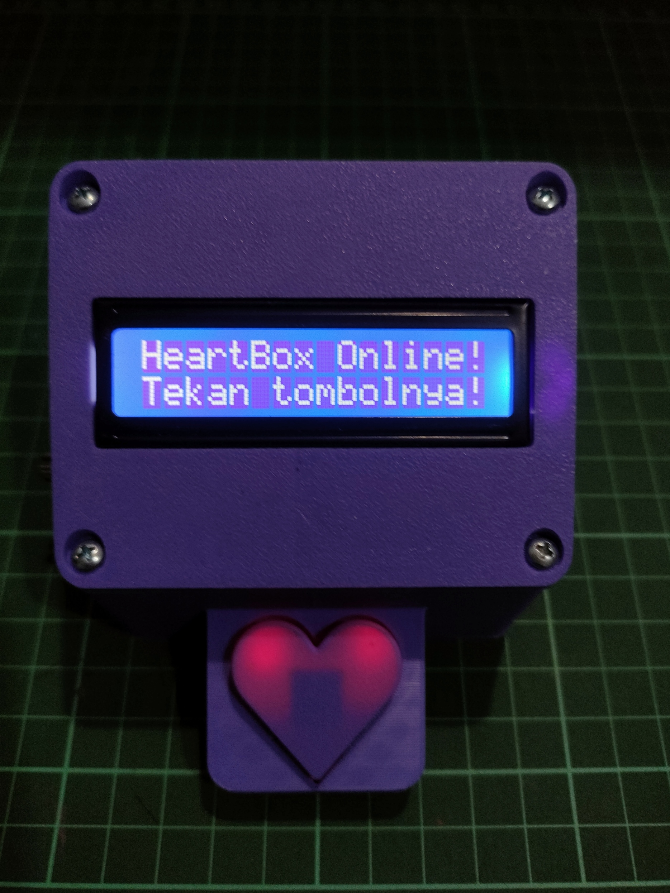

# HeartBox - Kotak Pesan Cinta Digital berbasis IoT Dengan ESP8266

<p align="center">
  
</p>

**HeartBox** adalah proyek IoT (Internet of Things) yang romantis dan personal. Bayangkan sebuah kotak fisik yang bisa menerima pesan teks yang dikirim dari mana saja di dunia melalui internet. Pesan ditampilkan di layar LCD, lengkap dengan notifikasi lampu LED yang berdenyut lembut. Ini adalah cara modern dan personal untuk mengirimkan "surat cinta" digital kepada orang terkasih.

## ✨ Fitur Utama

*   **Konfigurasi WiFi Mudah:** Portal web (Captive Portal) untuk menghubungkan perangkat ke jaringan WiFi tanpa mengubah kode.
*   **Penerima Pesan MQTT:** Menerima pesan secara real-time lewat protokol MQTT yang ringan.
*   **Tampilan LCD 16x2:** Pesan ditampilkan dengan efek teks berjalan.
*   **Notifikasi LED:** Dua LED berdenyut (*fade*) dan layar berkedip saat ada pesan baru.
*   **Penyimpanan Pesan:** Pesan terakhir disimpan di EEPROM, sehingga tidak hilang saat listrik padam (maksimal 127 karakter).
*   **Tombol Interaktif:** Satu tombol untuk membuka pesan, dan menekannya lagi untuk menutup pesan.
*   **Fungsi Reset:** Hapus konfigurasi WiFi dengan menahan tombol saat perangkat dinyalakan.
*   **Tampilan Portal Kustom:** Halaman portal konfigurasi bergaya minimalis dan mudah disesuaikan (CSS ada di dalam kode).
*   **Kode Non-Blocking (v5):** Tidak ada `delay()` di loop utama, sehingga MQTT, tombol, LED, dan LCD tetap responsif.
*   **Koneksi Ulang Cerdas:** Jika server MQTT tidak bisa dihubungi 5 kali berturut-turut, konfigurasi WiFi direset otomatis. Gangguan WiFi sementara **tidak** dihitung sebagai kegagalan.

## ⚙️ Kebutuhan Hardware

| Komponen | Keterangan |
| --- | --- |
| ESP8266 | NodeMCU v3 (atau sejenisnya; sesuaikan label pin D2–D8) |
| LCD 16x2 (HD44780) | Dikendalikan lewat shift register |
| IC 74HC595 | Shift register untuk LCD |
| Potensiometer 50K | Pengatur kontras LCD |
| Push Button | 1 buah |
| LED | 2 buah (merah muda/merah disarankan) |
| Resistor 220–330 Ω | **Wajib**, 1 per LED (jangan sambungkan LED langsung ke pin GPIO) |
| Breadboard / PCB dan kabel jumper | |

**Opsi daya portabel:** baterai 18650 + modul charger TP4056 (versi dengan proteksi) + step-up MT3608. Atur output MT3608 ke sekitar **5 V** dengan multimeter *sebelum* disambungkan ke pin `VIN` NodeMCU.

## 🔌 Gambaran Pemasangan Kabel
<p align="center">
  
</p>

## 📚 Kebutuhan Software & Library

1.  **[Arduino IDE](https://www.arduino.cc/en/software)** dengan board package ESP8266.
2.  **Library** (instal lewat Library Manager):
    *   `WiFiManager` oleh tzapu
    *   `PubSubClient` oleh Nick O'Leary
    *   `LiquidCrystal595` (library LCD dengan shift register)
    *   `EEPROM` (sudah termasuk di board package ESP8266)

> `ESP8266WebServer` dan `DNSServer` tidak perlu di-include manual karena sudah dibawa oleh WiFiManager.

## 🚀 Panduan Lengkap (Langkah-demi-Langkah)

### Langkah 1: Rakit Hardware
Hubungkan komponen sesuai definisi pin di `HeartBox.ino` (blok `pins::`).

| Komponen | Pin ESP8266 |
| --- | --- |
| LCD Data (ke 74HC595 pin 14 / DS) | `D6` |
| LCD Latch (ke 74HC595 pin 12 / ST_CP) | `D7` |
| LCD Clock (ke 74HC595 pin 11 / SH_CP) | `D8` |
| Tombol | `D4` (sisi lain tombol ke **GND**) |
| LED 1 | `D2` (lewat resistor, sisi lain ke **GND**) |
| LED 2 | `D3` (lewat resistor, sisi lain ke **GND**) |

**Catatan wiring penting:**

*   Tombol memakai `INPUT_PULLUP`, jadi kaki lainnya **harus ke GND**, bukan ke 3V3.
*   74HC595: pin 13 (`OE`) ke GND dan pin 10 (`MR`) ke VCC.
*   Urutan keluaran Q0–Q7 ke pin LCD (RS, E, D4–D7, backlight) harus mengikuti skema di README library `LiquidCrystal595`. Jika salah, LCD kosong atau menampilkan karakter acak.
*   Banyak LCD 16x2 redup atau kosong di 3.3 V. Beri daya LCD dari 5 V (`VIN`), sedangkan 74HC595 boleh tetap di 3.3 V.
*   Atur potensiometer 50K perlahan sampai teks di LCD terlihat jelas.

### Langkah 2: Konfigurasi Kode (`HeartBox.ino`)
Semua pengaturan ada di blok `cfg` di bagian atas file:

```cpp
namespace cfg {
  // --- Portal WiFi ---
  constexpr const char* AP_NAME     = "HeartBox-Setup";
  constexpr const char* AP_PASSWORD = "";   // Min. 8 karakter, "" = tanpa password

  // --- MQTT ---
  constexpr const char* MQTT_SERVER = "broker.hivemq.com";
  constexpr uint16_t    MQTT_PORT   = 1883;
  constexpr const char* MQTT_TOPIC  = "topik-unik-anda/heartbox/pesan";

  // --- Tampilan ---
  constexpr const char* IDLE_TEXT = "https://alamat-website-pengirim";
}
```

*   **`MQTT_TOPIC`**: Bagian paling penting. **Ganti dengan topik yang unik** dan samakan persis dengan topik di halaman web pengirim (`app.tsx`). Contoh: `seseorang/hadiah/1`.
*   **`AP_NAME`**: Nama WiFi saat mode setup, misalnya `HeartBox-Seseorang`.
*   **`AP_PASSWORD`**: Password portal. Pilih yang tidak mudah ditebak (hindari tanggal lahir).
*   **`IDLE_TEXT`**: Teks berjalan saat idle. Bisa diisi link website pengirim.
*   **Client ID MQTT** dibuat otomatis dari chip ID (`HeartBox-xxxxxx`), jadi tidak perlu diatur manual.

Parameter lain yang bisa disesuaikan di `cfg`: `MQTT_MAX_RETRIES`, `MQTT_RETRY_INTERVAL_MS`, `SCROLL_DELAY_MS`, `BLINK_INTERVAL_MS`, `LED_FADE_STEP_MS`, dan `DEBOUNCE_MS`.

### Langkah 3: Upload Sketch
Pilih board (misal: "NodeMCU 1.0 (ESP-12E Module)") dan port yang benar di Arduino IDE, lalu upload sketch ke ESP8266.

## 🎮 Cara Penggunaan

### 1. Konfigurasi WiFi (Hanya Sekali)
*   Setelah upload, nyalakan perangkat. LCD menampilkan "Connecting...".
*   Jika belum ada WiFi tersimpan, perangkat membuat Access Point sesuai `AP_NAME`, dan LCD menampilkan nama AP tersebut.
*   Hubungkan ponsel/laptop ke AP itu (masukkan password jika diatur).
*   Halaman portal muncul otomatis. Jika tidak, buka `192.168.4.1` di browser.
*   Pilih WiFi rumah, masukkan password, lalu klik "Save".
*   Jika berhasil, LCD menampilkan "HeartBox Online!".

### 2. Mengirim Pesan
*   Gunakan halaman `template website` yang disediakan atau klien MQTT lain.
*   Kirim ke **topik yang sama persis** dengan `MQTT_TOPIC`.
*   Pesan lebih dari 127 karakter akan dipotong.

### 3. Membaca Pesan
Perangkat bekerja dengan tiga mode:

| Mode | Tampilan | Aksi |
| --- | --- | --- |
| **Idle** | "HeartBox Online!" dengan `IDLE_TEXT` berjalan di baris 2 | Menunggu pesan |
| **Pesan Baru** | LCD berkedip ("Ada Pesan Nih / Untuk Kamu ♥"), LED berdenyut | Tekan tombol untuk membaca |
| **Menampilkan Pesan** | "♥PESAN  SPESIAL♥", pesan berjalan di baris 2 | Tekan tombol lagi untuk kembali ke Idle |

Pesan terakhir tersimpan di EEPROM. Setelah perangkat dinyalakan ulang, pesan tersebut dianggap sebagai pesan baru.

## 🛠️ Fungsi Khusus & Troubleshooting

*   **Reset Pengaturan WiFi:** Matikan perangkat, tahan tombol, lalu nyalakan sambil tetap menahan tombol. Pengaturan WiFi dihapus dan perangkat masuk lagi ke mode AP.

*   **Gagal Terhubung ke Server MQTT:** Jika WiFi terhubung tetapi server MQTT tidak bisa dihubungi, perangkat mencoba lagi tiap 5 detik. Setelah 5 kali gagal berturut-turut, pengaturan WiFi dihapus dan perangkat restart ke mode konfigurasi. Jika WiFi sedang putus, percobaan ditunda dan tidak dihitung sebagai kegagalan.

*   **LCD kosong atau redup:** Putar potensiometer kontras, pastikan LCD mendapat 5 V, dan periksa urutan kabel 74HC595 ke LCD.

*   **LCD menampilkan karakter acak:** Urutan Q0–Q7 ke pin LCD tidak sesuai dengan yang diharapkan library `LiquidCrystal595`.

*   **Tombol tidak merespons:** Pastikan sisi lain tombol terhubung ke GND, bukan 3V3.

*   **LED redup:** PWM ESP8266 secara default berskala 0–1023, sedangkan kode fade berhenti di 255. Naikkan batas maksimum di `updateLedFade()` jika ingin lebih terang.

## 🔒 Catatan Keamanan

*   `broker.hivemq.com` adalah broker publik tanpa autentikasi. Siapa pun yang tahu topik Anda bisa mengirim pesan ke HeartBox, jadi gunakan topik panjang dan acak. Untuk keamanan lebih, gunakan broker pribadi dengan username/password.
*   Jangan memakai tanggal lahir atau informasi pribadi sebagai password AP.

---